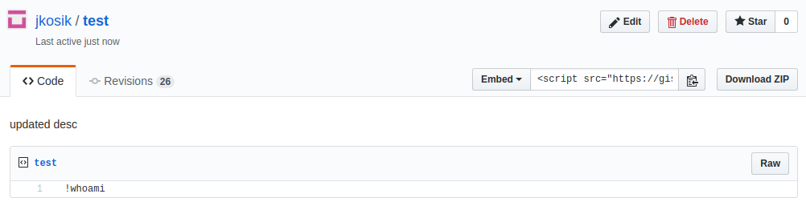

## About gistcc:
* Gist/Git-commanded Bot 
* `gistcc` parses selected Gist @github, identifies commands and executes them on remote machine (e.g. Bot).
* Command output is stored back on Gist to provide console look&feel.


## Command examples:
* Create a new Gist: $gistcc.py --new NEW_GIST_NAME --token YOUR_GITHUB_TOKEN
* Run gistcc: $gistcc.py --name GIST_NAME --id GIST_ID --token YOUR_GITHUB_TOKEN
* Delete existing Gist: $gistcc.py --delete --id GIST_ID --token YOUR_GITHUB_TOKEN
    
## Gist command syntax (pushed to the remote machine as Gist edits):
* !commmand (first occurence of !command is executed on local machine)
* !cat /etc/passwd
* !xterm mc 
* ?-t20 (sets timeout for command runtime to 20 seconds. Concerns only console commands, not external processes)
  
## Generate GitHub token (Prerequisite)


## Create a new Gist
* manually via GitHub GUI
* using `gistcc` directly (provides back Gist ID - needed for the following command execution)
```
juraj@home:/tmp/gistcc$ python3 gistcc.py --new test --token CHANGE_ME
Your new Gist Name is: test
Your new Gist ID is: 123456789123456789123456789
Ready to run: $gistcc.py --name test --id 123456789123456789123456789 --token CHANGE_ME
```

### New Gist has been created


## Start Bot on the remote machine
```
juraj@home:/tmp/gistcc$ python3 gistcc.py --name test --id 123456789123456789123456789 --token CHANGEME
```
...and now manage the remote machine via Gist edits
  
### Workflow
1. First line in Gist starting with exclamation mark (`!`) is interpreted as command.
2. Command is executed on the remote machine.
3. Command output is uploaded back to Gist and exclamation marks are converted to comment signs (`#`) to cleanup.
4. Gist Revisions can be used to store command history execution,

#### 1. Command is sent


#### 2. Command is executed on the remote machine
```
juraj@home:/tmp/gistcc$ python3 gistcc.py --name test --id 123456789123456789123456789 --token CHANGE_ME
NO new command found @Gist
NO new command found @Gist
New command found @Gist: uname
Subprocess executed

Linux
Command output uploaded...Check Gist.

NO new command found @Gist
NO new command found @Gist
New command found @Gist: ls
Subprocess executed

gistcc.py
README.md
Command output uploaded...Check Gist.

NO new command found @Gist
NO new command found @Gist
NO new command found @Gist
New command found @Gist: whoami
Subprocess executed

juraj
Command output uploaded...Check Gist.
```

#### 3. Command output is uploaded back to Gist


#### 4. Gist revisions provide command output history


